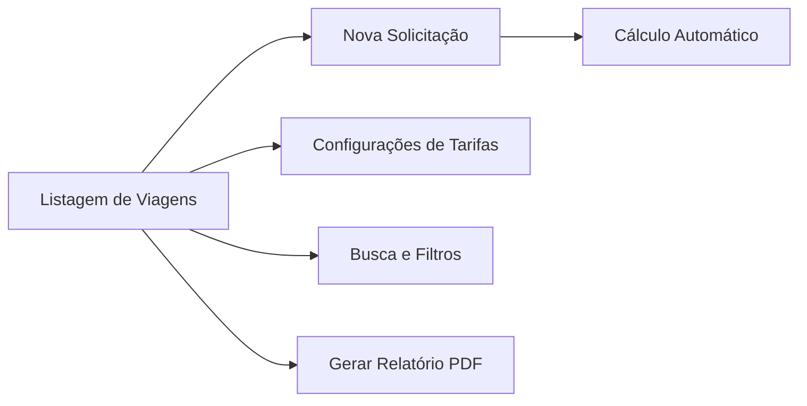

# 🚕 KadornaTaxi - Controle de Viagens e Relatórios Profissionais


O **KadornaTaxi** é uma ferramenta completa para motoristas de táxi que buscam profissionalismo e agilidade no controle de suas corridas. O app automatiza cálculos de tarifas, organiza o histórico de viagens por período e gera relatórios profissionais em PDF para prestação de contas.

---

## 🚀 Funcionalidades Principais

- **⚙️ Configurações Personalizadas**: Personalização completa de valores por KM rodado, hora de espera e dados do motorista para cabeçalhos de relatórios.
- **📝 Solicitação Inteligente**: Registro de viagens com preenchimento automático de data/hora e cálculo em tempo real de KM, espera e valor total.
- **🏷️ Classificação de Viagens**: Organização inteligente entre viagens "Comuns" e "Separadas" (ideal para convênios ou clientes específicos).
- **📊 Visualização Organizada**: Histórico de viagens agrupado por mês/ano com resumo detalhado de ganhos.
- **📄 Relatórios PDF Avançados**: Geração automática de documentos profissionais com quebra de página, somatórias automáticas e cabeçalho personalizado.
- **🔍 Filtragem Dinâmica**: Busca rápida por texto (origem, destino, motorista) e filtros simplificados via Chips.
- **💾 Persistência Confiável**: Gerenciamento robusto via SQLite com suporte a migrações de versão.

---

## 🛠️ Tecnologias Utilizadas

O projeto utiliza o desenvolvimento Android Nativo:

- **Core**: [Android SDK](https://developer.android.com/) (Mistura estratégica de **Java** e **Kotlin**)
- **Persistência**: [SQLite](https://www.sqlite.org/) para armazenamento local seguro
- **Interface**: XML Layouts
- **Relatórios**: Geração nativa de PDF com suporte a múltiplas páginas
- **Arquitetura**: Baseada em MVC (Model-View-Controller) com DAOs para acesso a dados

---

## 📂 Estrutura de Navegação




> [!TIP]
> Para uma descrição detalhada de cada tela e seus campos, consulte o [Fluxo de Execução](docs/fluxo-app.md).


---

## 💻 Como Executar o Projeto

1. **Clone o repositório**:
   ```bash
   git clone [https://github.com/Joseesanto14/KadornaTaxi.git]
   ```

2. **Abra no Android Studio**:
   Importe o projeto como um projeto Gradle.

3. **Build e Run**:
   Selecione um dispositivo físico ou emulador (API 27+) e clique em **Run**.

---

## 🎨 Design

A interface foi projetada com foco na usabilidade do motorista durante o expediente, utilizando elementos visuais claros, cores de alto contraste (Verde Kadorna) e componentes táteis de fácil interação.

---

## 📄 Licença

Consulte o arquivo `LICENSE` para mais detalhes sobre os termos de uso.

---
Desenvolvido com ❤️ para a modernização do serviço de táxi.
